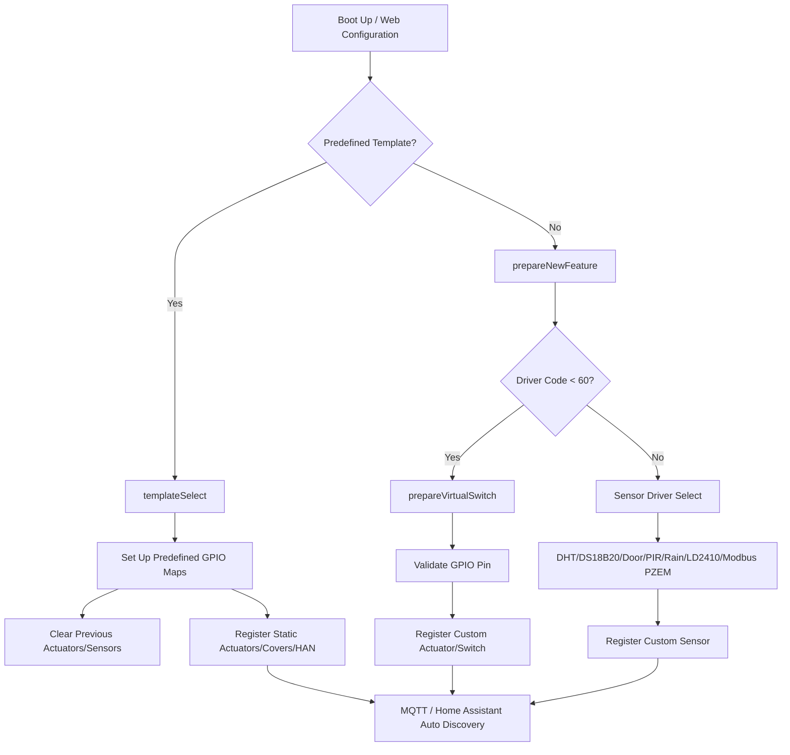

# How to Build, Configure, and Provision EasyIot Firmware

This guide provides a comprehensive walkthrough for configuring, compiling, and flashing the EasyIot firmware. It also details the internal architecture of predefined (classic) hardware templates and dynamically configured (new) features.

---

## 1. Environment Configuration & Requisites

EasyIot is built using **PlatformIO** inside **Visual Studio Code** or **CLion**.

### Prerequisites
- **VS Code** with the **PlatformIO IDE** extension installed.
- **Node.js** (required to compile web panel assets).
  - Install minification tools globally:
    ```bash
    npm install -g html-minifier uglify-js uglifycss
    ```

### Local Overrides
You can create a `platformio_override.ini` in the repository root (based on `platformio.ini`) to override default build flags, custom Wi-Fi credentials, or MQTT settings without checking them into Git.

---

## 2. Compilation & Flashing

PlatformIO defines multiple targets for ESP8266 and ESP32.

### Typical Targets
- `ESP8266_DEBUG` / `ESP8266_RELEASE`: Standard builds for ESP8266 chips (such as the ESP-12E used on the OnOfre boards).
- `ESP32_DEBUG` / `ESP32_RELEASE`: Standard builds for ESP32 modules (supporting 8MB or 4MB flash).
- `ESP32C3_HAN` / `ESP8266-HAN_RELEASE`: Specific smart meter integration profiles.

### Commands

#### Compile Firmware
To compile a specific environment (e.g. `ESP8266_DEBUG`):
```bash
pio run -e ESP8266_DEBUG
```

#### Upload / Flash Firmware
Connect the module via serial programmer and run:
```bash
pio run -t upload -e ESP8266_DEBUG
```
The output binary will be saved under `.pio/build/<env_name>/firmware.bin`.

---

## 3. Initial Provisioning (Captive Portal)

1. **AP Mode Startup:** On first startup (or if configured Wi-Fi is unreachable), the device starts a Captive Portal Access Point.
   - **SSID:** `ONOFRE_xxxxxx` (where `xxxxxx` is a unique chip identifier).
   - **Password:** `bhonofre`
2. **Access Web Panel:** Connect to the AP and open `http://192.168.4.1` or `http://onofre.local`.
3. **Configure Settings:** Configure local Wi-Fi credentials, MQTT broker IP, credentials, and custom nodes/topics. Once saved, the device resets and attempts to connect in STA (Station) mode.

---

## 4. How Predefined and Dynamic Features Work

EasyIot divides hardware features into two categories: **Predefined Templates** (static profiles) and **Dynamic Custom Features** (new features).



### A. Predefined (Classic) Templates
Predefined templates map static hardware profiles (GPIO connections) for retail products or specific board layouts. They are managed in `src/Templates.cpp` inside `templateSelect(enum Template _template)`.

Selecting a template automatically clears any custom features and registers preconfigured inputs/outputs:
- **`DUAL_LIGHT` & `DUAL_SWITCH`:** Maps two relay outputs and push-button inputs (e.g. `DefaultPins::OUTPUT_ONE`/`INPUT_ONE` etc.).
- **`COVER`:** Maps dual push cover controls (e.g., roller shutter blinds).
- **`GARAGE`:** Configures gate motors, push switches, and open/close door status feedback sensors.
- **`HAN_MODULE`:** Pre-configures smart meter Modbus protocol integration (for Kaifa, Landis+Gyr, Sagemcom meters) to track energy usage.
- **`GARDEN`:** Configures multiple irrigation garden valves.

### B. Dynamic Custom Features (New Features)
If a generic board or custom DIY sensor is used, you can add features dynamically using the Web Panel. The web server forwards the POST parameters to `prepareNewFeature()` in `src/Templates.cpp`.

```cpp
int prepareNewFeature(String name, unsigned int input1, unsigned int input2, int driverCode)
```

The firmware routes the `driverCode` depending on whether it represents an actuator or sensor:

1. **Actuators (driverCode < 60):**
   - Handled by `prepareVirtualSwitch()`.
   - Validates the selected GPIO pins via `config.validPin()`.
   - Instantiates a virtual actuator using the selected input buttons/switches and types.
   - Clears output pins to use software/network triggers.
2. **Sensors (driverCode >= 60):**
   - Handled via a switch-case selecting the specific hardware sensor driver.
   - **Available Drivers:**
     - `DHT_11`, `DHT_21`, `DHT_22`: Temperature and humidity.
     - `DS18B20`: OneWire temperature probes.
     - `DOOR`, `WINDOW`: Magnetic reed status switches.
     - `PIR`: Motion detectors.
     - `HCSR04`: Ultrasonic distance sensors.
     - `RAIN`: Rain presence detectors.
     - `LD2410`, `LD2450`, `LD2460`: mmWave radar human presence sensors.
     - `PZEM_004T_V03`, `PZEM_004T_V01`: Modbus PZEM electricity monitors.

---

## 5. MQTT and Home Assistant Auto-Discovery

Whether a feature is registered via a predefined template or custom dynamic config, the system assigns it a `uniqueId`.

- When the MQTT broker connects, `HomeAssistantMqttDiscovery.cpp` generates a JSON payload for Home Assistant's auto-discovery topics (e.g. `homeassistant/light/.../config` or `homeassistant/sensor/.../config`).
- This allows Home Assistant to automatically detect, name, and show the device controls without requiring manual configuration in Home Assistant's `configuration.yaml`.
- Custom topic formats are based on the configured `nodeId` (e.g. `onofre/uniqueId/set` for commands and `onofre/uniqueId/state` for status).

---

## 6. Running Automated Tests

EasyIot supports automated unit testing (C++ firmware logic) and E2E integration testing (Web UI & REST APIs) to ensure code stability.

### A. Firmware Unit Tests (PlatformIO Native)
We run unit tests compiled natively on your local development machine to verify core firmware algorithms and logic (e.g., dimmer range scaling, shutter runtime calculations, Modbus registers, and auto-off timers).

* **Command to run tests locally**:
  ```bash
  pio test -e native
  ```
* **Location of tests**: Test cases are defined inside `test/test_main.cpp`.

### B. Web UI & REST API Integration Tests (Playwright)
To test the web panel interface, mock the ESP web APIs, and verify browser layout/responsiveness, we use a headless E2E testing framework based on Playwright and Express.js.

* **Prerequisites**:
  - Node.js installed.
  - Switch to the `test/web-integration` branch.
* **Commands to run web tests**:
  ```bash
  # 1. Navigate to test folder
  cd web-tests

  # 2. Install testing dependencies
  npm install

  # 3. Install Playwright browser engines
  npx playwright install chromium

  # 4. Execute the test runner
  npm test
  ```
* **Tested Viewports / Emulated Devices**:
  The tests automatically execute across three emulated device profiles to ensure the responsive dashboard renders correctly on both mobile and desktop screens:
  - **Desktop Chrome** (Standard viewport)
  - **iPhone 13** (Safari iOS mobile viewport)
  - **Pixel 5** (Chrome Android mobile viewport)
* **Tested Scenarios**:
  - Config loading UI bindings.
  - SSID and configuration update payload validations (POST `/config`).
  - Wizard-based new feature creation validations (POST `/features/add`).
  - Reboot command confirmations (POST `/reboot`).

